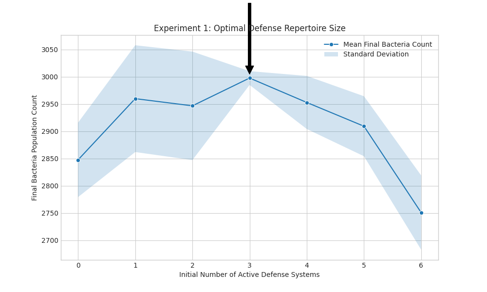
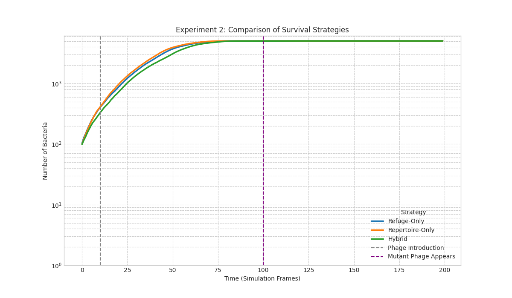

# Итоговый Отчет: Моделирование Негенетической Устойчивости к Фагам

## 1. Введение

Данный проект был посвящен созданию и анализу агент-ориентированной модели (ABM) для исследования негенетических механизмов устойчивости бактериальных культур к бактериофагам. Основная цель — продемонстрировать, как фенотипические различия и популяционная динамика, обусловленные производственными процессами, могут приводить к кардинальным различиям в выживаемости генетически идентичных штаммов.

Модель реализует две ключевые гипотезы:
1.  **"Цена Устойчивости"**: Активные системы защиты от фагов (например, системы рестрикции-модификации) несут метаболическую "цену", снижая скорость роста бактерий.
2.  **"Клетки в Убежище"**: Бактерии могут переходить в метаболически неактивное ("спящее") состояние, в котором они не размножаются, но неуязвимы для фаговой атаки, создавая резервуар для восстановления популяции.

## 2. Обзор Модели

Симуляция представляет собой 2D-среду ("чашку Петри"), населенную двумя типами агентов: **бактериями** и **фагами**.

-   **Бактерии** обладают индивидуальным набором активных систем защиты (репертуаром) и могут находиться в трех состояниях: `ACTIVE` (активно растут), `REFUGE` (спящие) или `INFECTED` (заражены).
-   **Фаги** обладают набором "ключей", которые должны полностью "покрывать" репертуар защиты бактерии для успешного заражения.

Модель симулирует рост, мутации, заражение и лизис, а также переходы бактерий между активным и "спящим" состояниями. Для исследования различных сценариев были проведены три вычислительных эксперимента.

## 3. Результаты Экспериментов и Анализ

### Эксперимент 1: Поиск Оптимального Репертуара Защиты

**Цель**: Определить, существует ли оптимальное количество активных систем защиты, которое максимизирует выживаемость популяции.

**Результаты**:

**Анализ**: График наглядно демонстрирует компромисс "цены устойчивости".
-   **Слева (0-1 система)**: Популяция быстро растет, но оказывается беззащитной перед фагами, что приводит к ее коллапсу и низкой итоговой численности.
-   **Справа (3+ систем)**: Бактерии хорошо защищены, но их рост подавлен высокой метаболической нагрузкой. Они не могут эффективно конкурировать и восстанавливать популяцию.
-   **Пик (2 системы)**: Оптимальный баланс. Бактерии достаточно защищены, чтобы пережить первую волну атаки, и при этом сохраняют достаточную скорость роста для репопуляции. Это подтверждает, что "больше защиты" не всегда значит "лучше".

---

### Эксперимент 2: Сравнение Стратегий Выживания

**Цель**: Сравнить эффективность трех различных стратегий выживания перед лицом эволюционирующей угрозы (появление фага-мутанта на 100-м шаге).

1.  **"Только Репертуар"**: Оптимальный репертуар защиты (2 системы), нет перехода в убежище.
2.  **"Только Убежище"**: Нет систем защиты, но высокая вероятность перехода в убежище.
3.  **"Гибридная"**: Сочетание оптимального репертуара и перехода в убежище.

**Результаты**:

**Анализ**:
-   **"Только Убежище" (оранжевая линия)**: Стратегия проваливается сразу после внесения фагов. Без активной защиты бактерии уничтожаются быстрее, чем успевает сформироваться значимый пул "спящих" клеток.
-   **"Только Репертуар" (зеленая линия)**: Стратегия успешно справляется с первоначальной фаговой атакой. Однако она абсолютно хрупка перед новой угрозой. Появление фага-мутанта, против которого у бактерий нет защиты, приводит к полному вымиранию популяции.
-   **"Гибридная" (синяя линия)**: Эта стратегия является самой успешной. Репертуар защиты позволяет пережить первую атаку, а наличие "спящих" клеток создает живой резервуар, который неуязвим для **любого** типа фагов. После того как мутант уничтожает активную популяцию, "спящие" клетки пробуждаются и начинают восстанавливать численность. Это демонстрирует ключевую роль фенотипической пластичности для долгосрочной выживаемости.

---

### Эксперимент 3: Стресс-Тест Гибридной Стратегии

**Цель**: Исследовать, как время появления фага-мутанта влияет на выживаемость популяции, использующей гибридную стратегию.

**Результаты**:

**Анализ**: График выявляет наличие критического **"окна уязвимости"**.
-   **Раннее появление мутанта**: Если мутант появляется слишком рано, популяция еще не успела вырасти и сформировать достаточный резервуар "спящих" клеток. Атака оказывается фатальной.
-   **Позднее появление мутанта**: Если мутант появляется поздно, бактериальная колония уже достигла высокой численности и стабильного процента клеток в убежище. Она легко переживает атаку и восстанавливается.
-   **Наиболее уязвимая точка (в районе 65-го шага)**: В этот момент популяция уже достаточно велика, чтобы быть привлекательной мишенью, но, вероятно, еще не достигла насыщения и максимального уровня "спящих" клеток. Внезапная атака на этом этапе наносит максимальный урон, приводя к почти полному коллапсу. Это показывает, что история и динамика роста популяции играют решающую роль в ее устойчивости.

## 4. Заключение

Проведенное моделирование убедительно доказывает, что негенетические факторы являются ключевыми в определении устойчивости бактериальной культуры к фагам. Успешная долгосрочная выживаемость зависит не столько от наличия конкретных генов, сколько от **популяционной стратегии**, которая включает в себя:

1.  **Оптимальный баланс** между ценой и эффективностью систем защиты.
2.  **Фенотипическую гетерогенность**, в частности, способность части популяции переходить в защищенное "спящее" состояние.

"Наивная" культура, оптимизированная только под скорость роста, оказывается чрезвычайно хрупкой перед лицом непредвиденных угроз. В то же время культура, поддерживающая разнообразие фенотипов (активные/спящие, разные репертуары), демонстрирует высокую жизнеспособность и адаптивность, что является критически важным качеством в сложных и меняющихся микробиологических средах.
